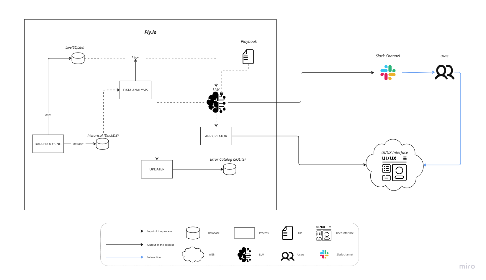

# Savvy — Payment Conversion Control Tower

> **Savvy detects a meaningful payment-conversion drop, explains the affected route and evidence, and prioritizes the next investigation before revenue loss goes unnoticed.**

Savvy is a NEXTWAVE HACKATHON 2026, presented by Yuno × Nauta. It monitors payment-orchestration traffic, separates credible conversion incidents from expected variation, and turns them into operational reports for a dashboard and Slack.

It is a diagnosis system: it detects, explains, prioritizes, and recommends.

## The problem

Payment conversion can degrade silently in a narrow route: one provider, country, payment method, issuing bank, merchant, or a combination of those dimensions. A broad alert or a generic dashboard still leaves an operator to manually filter data and answer the hard questions:

- Is this a real drop or expected time-of-week variation?
- Which cell is the origin rather than a diluted parent symptom?
- How many attempts and how much monetary exposure are involved?
- Is the evidence sufficient to recommend action?
- Which incident should be handled first when several happen at once?

Savvy addresses that investigation path end to end.

## What Savvy does

1. **Processes payment events** into a canonical live representation while retaining historical aggregates for baselines.
2. **Detects anomalous conversion drops** with statistical, materiality, and volume gates against each cell’s historical behavior.
3. **Clusters related signals into incidents**, preserving one incident lifecycle instead of alerting separately for every parent and child cell.
4. **Builds a diagnosis** with evidence, confidence, an explanation, alternatives ruled out, and a recommended action.
5. **Publishes the result** to Slack and to a revisioned dashboard feed consumed by the web UI.

The dashboard shows the latest revision per incident; the detail view retains report history and the evidence behind each conclusion.

## Architecture

The architecture image is part of this repository and should be referenced in Markdown as follows:

```markdown

```


If the image cannot render, its flow is: **Data Processing** writes historical Parquet/DuckDB artifacts and a live SQLite store; **Data Analysis** evaluates the data and triggers the diagnosis path; the **Playbook** guides the **LLM**; the LLM sends incident context to **Slack** and to the **App Creator/UI** path; and the **Updater** writes to the SQLite error catalog. Users interact with the UI and receive the Slack notifications. The diagram groups the processing, storage, analysis, playbook, LLM, updater, and app-creation components inside the Fly.io deployment boundary.

| Diagram component | Role in Savvy | Repository implementation / integration |
| --- | --- | --- |
| Data Processing | Produces payment data for historical and live use. | `pipeline/` generates, normalizes, deduplicates, and materializes data. |
| Historical store (DuckDB + Parquet) | Holds read-only historical aggregates used for contextual baselines. | `data/gold/historical.duckdb` plus Parquet artifacts generated by `pipeline/gold/`. |
| Live store (SQLite) | Receives current payment attempts for the live detector. | `data/gold/live.sqlite`. |
| Data Analysis | Scans conversion behavior, detects signals, clusters them, and manages incident lifecycle. | `agent_workflow/baselines/`, `agent_workflow/detect/`, and `agent_workflow/main.py`. |
| Playbook + LLM | Guides evidence-based diagnosis rather than formatting an alert blindly. | `agent_workflow/agent/playbook.md` and `agent_workflow/agent/`. |
| Updater / error catalog | Represents the diagram’s persistent learning and catalog-update path. | Catalog and incident-memory modules under `agent_workflow/catalogue/` and `agent_workflow/memory/`. |
| Slack channel | Delivers deterministic root alerts and diagnosis follow-ups. | `agent_workflow/slack/`; supports Slack App credentials or an incoming webhook. |
| UI/UX interface | Lets operators inspect reports and lets judges inject a controlled live incident. | Static dashboard files in the repository root plus `scripts/web_server.py`. |

### Data flow

1. Historical data establishes a baseline; live payment attempts are written to SQLite.
2. The detector polls the live data, compares each populated cell with its baseline, and emits only signals that pass all gates.
3. Related signals are clustered into an incident. A deterministic Slack root alert can be emitted immediately.
4. The diagnosis worker uses the playbook and structured tools to collect evidence. If the evidence is weak, it returns `insufficient_evidence` instead of fabricating a root cause.
5. `ReportPublisher` stores report revisions and atomically exports `data/dashboard-reports.json`.
6. The dashboard fetches that JSON feed; it never reads SQLite directly.

## How Savvy handles real payment-operations scenarios

| Scenario | Savvy behavior |
| --- | --- |
| Expected hourly or weekly variation | Uses a cell’s historical baseline before deciding that a drop is anomalous. |
| Low-volume noise | Requires a minimum number of attempts in addition to statistical and percentage-point gates. |
| Partial provider or issuer degradation | Detects at one- and two-dimension groupings, then clusters related parent/child signals into one incident story. |
| Several incidents at once | Tracks separate incidents and exposes their current reports side by side for prioritization. |
| Ambiguous cause or cold-start baseline | Makes uncertainty explicit with `insufficient_evidence`; it does not turn an unknown into a confident diagnosis. |
| Long-running incident | Keeps a single incident lifecycle and report revisions instead of repeatedly creating the same root alert. |
| Decline-code shift | Uses decline codes to characterize an already anomalous conversion cell, rather than treating a decline code itself as a conversion-rate dimension. |


## Run the live demo

### Prerequisites

- Python 3.12 or newer
- Node.js (only needed for the dashboard verifier)
- A modern browser

Optional integrations:

- `OPENAI_API_KEY` enables LLM diagnosis.
- `SLACK_BOT_TOKEN` and `SLACK_CHANNEL` enable the Slack App transport.
- `SLACK_WEBHOOK_URL` enables the incoming-webhook transport when App credentials are not configured.

Keep credentials in a local `.env` file or environment variables; do not commit them.

### 1. Install dependencies and prepare the baseline

From the repository root:

```bash
python -m venv .venv
# macOS/Linux
source .venv/bin/activate
# Windows PowerShell: .\.venv\Scripts\Activate.ps1

python -m pip install --upgrade pip
python -m pip install -r requirements.txt

python -m pipeline.generator.generate_historical_aggregates --seed 42
python -m agent_workflow.analysis.t1 --store gold
```

On macOS or Linux, `./scripts/bootstrap.sh` performs the same setup sequence.

### 2. Start the three live processes

Use three terminals, all from the repository root with the virtual environment activated:

```bash
# Terminal 1 — live payment-event generator
python -m pipeline.generator.generate_live_stream --duration 0
```

```bash
# Terminal 2 — detector, incident lifecycle, diagnosis, Slack, and reporting
python -m agent_workflow.main --live
```

```bash
# Terminal 3 — dashboard plus judge-injection API
python scripts/web_server.py --port 8000
```

Open [http://localhost:8000](http://localhost:8000).

### 3. Trial by fire: inject an incident live

The dashboard’s **Inject a conversion-rate drop** panel posts a validated request to the same-origin `/api/injections` endpoint. The server writes one pending trigger, and the live generator consumes it on its next tick. The injected failures follow the same Bronze → Silver → Gold → detection path as ordinary events—no team member needs to edit the database or manually create an incident.

The detector opens and diagnoses the resulting incident, the reporting step refreshes the JSON dashboard feed, and the dashboard reloads the updated reports after the injection. Only one pending injection is accepted at a time, which makes the demo state deterministic and prevents overlapping trigger-file writes.

### Verify the dashboard contract

```bash
node verify-dashboard-contract.js
```

For the Python test suite:

```bash
python -m unittest discover -s tests -p "test_*.py"
```

## Technology stack

- **Python** — detection workflow, generator, reporting, Slack integration, and local web server
- **DuckDB + Parquet** — historical aggregates and baseline context
- **SQLite** — live attempts, incident memory, and revisioned reporting data
- **OpenAI API** — optional structured diagnosis worker
- **Slack API / incoming webhooks** — operational alert delivery
- **HTML, CSS, and vanilla JavaScript** — responsive incident dashboard and judge-injection controls
- **Fly.io** — deployment boundary shown in the architecture diagram

## Repository map

| Path | Purpose |
| --- | --- |
| `pipeline/` | Synthetic historical/live generation and Bronze, Silver, and Gold data processing. |
| `agent_workflow/` | Baselines, detector, clustering, incident lifecycle, economics, diagnosis, Slack, memory, and reporting. |
| `scripts/web_server.py` | Dashboard server, health endpoint, and validated judge-injection API. |
| `index.html` / `incident-detail.html` | Dashboard and revision-aware incident detail views. |
| `dashboard-*.js` / `dashboard.css` | Frontend data handling, rendering, injection controls, and shared styles. |
| `DASHBOARD-CONTRACT.md` | Contract between the reporting producer and the dashboard consumer. |
| `docs/decision_log.md` | Architecture decisions and trade-offs. |
| `savvy_architecture.png` | Architecture diagram embedded above. |

## Team

Built for NEXTWAVE HACKATHON 2026 — Yuno × Nauta.
Emilia Macarena Arriaga emiliaarriaga002@gmail.com
Claudia Citlali Barco Núñez clau.barco21@gmail.com
María Lucía Rivas Gil ma.luciarg11@gmail.com
Emilio Sebastián Ospino Merida emilio.sebastian.ospino@gmail.com
