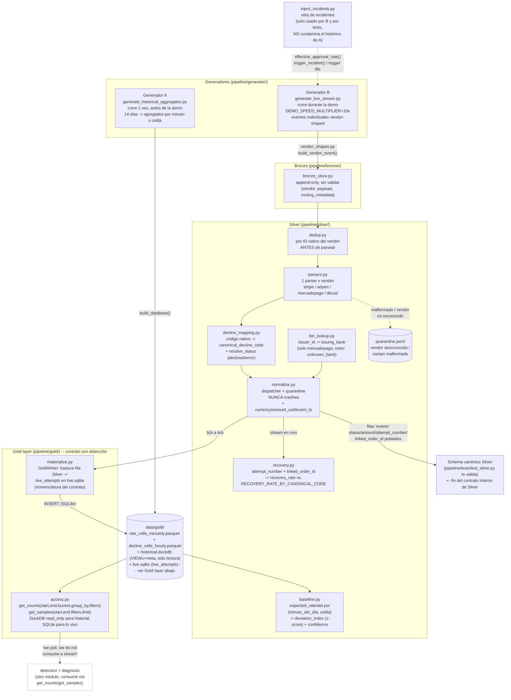

# Arquitectura — Generación de datos + Preprocesamiento (Bronze/Silver)

## Vista general



## Por qué dos grains de "celda" (ver decision_log.md para el detalle)

```
Rate cell     = (provider, country, payment_method, issuing_bank)     -> 54 celdas
Recovery cell = (provider, country, payment_method, decline_code)     -> 108 celdas

Ninguna incluye merchant_id (el ejemplo de volumen validado del brief usa
solo esas 4 dims). merchant_id vive a nivel de evento individual.
```

## Las dos "shapes" de fila que produce Silver (mismo schema canónico)

```
Fila "evento" (normalize.py, desde el stream en vivo):
  time_bucket, minute_of_day, weekday, merchant_id, provider,
  payment_method, country, issuing_bank, canonical_decline_code,
  status, amount, attempt_number, linked_order_id   <- poblados
  attempts, approvals, actual_rate, expected_rate,
  expected_std, deviation_index, recovery_rate,
  recovery_rate_deviation, confidence                <- None

Fila "celda agregada" (baseline.py / recovery.py, desde el histórico):
  time_bucket, minute_of_day, weekday, provider, payment_method,
  country, issuing_bank y/o canonical_decline_code,
  attempts, approvals, actual_rate, expected_rate,
  expected_std, deviation_index, confidence,
  recovery_rate, recovery_rate_deviation             <- poblados
  status, amount, attempt_number, linked_order_id,
  merchant_id                                          <- None
```

## Gold layer: 2 motores, cada uno donde encaja (pipeline/gold/)

Se probó (spike real, ver decision_log.md) que DuckDB NO soporta
lector+escritor concurrentes sobre un mismo archivo — un solo proceso
puede tenerlo abierto, punto, ni en modo `read_only` si hay otra conexión
abierta. SQLite sí soporta ese patrón. Entonces:

```
data/gold/
  rate_cells_minutely.parquet     Parquet, escrito 1 vez por el Generador A
  decline_cells_hourly.parquet    Parquet, escrito 1 vez por el Generador A
  historical.duckdb               VIEWs sobre esos 2 parquet + tabla meta.
                                   Solo lectura para siempre después de
                                   generarse -> cualquier cantidad de
                                   lectores concurrentes (read_only=True)
                                   anda bien, nunca hay un writer.
  live.sqlite                     live_attempts, SQLite. 1 writer
                                   (GoldWriter, todo el Generador B) + N
                                   lectores concurrentes (detección haciendo
                                   poll desde otro proceso) -- el patrón
                                   que SQLite soporta nativo.

rate_cells_minutely    grain: minuto x (merchant_id, provider_id, country,
                        method, issuing_bank). SIN decline_code.
                        columnas: attempts, approved, declined, error,
                        amount_usd_total.  ~5.7M filas / 14 días (~8.5MB
                        parquet, comprimido ZSTD).

decline_cells_hourly   grain: hora x (merchant_id, provider_id, country,
                        method, issuing_bank, decline_code).
                        columnas: declines, recovered, amount_usd_total.
                        ~150K filas / 14 días (~600KB parquet).

live_attempts           grain: 1 fila = 1 intento real. Solo Generador B.
                         columnas: attempt_id, payment_id, attempt_number,
                         event_ts, merchant_id, provider_id, method,
                         country, issuing_bank, status, decline_code,
                         amount_minor, currency, amount_usd.
```

`get_counts(start_ts, end_ts, bucket, group_by, filters)` rutea así:

```
                     ¿el rango pedido cae antes de history_end (meta)?
                                    |
              SI, antes  ─────────────────────  NO, después
                    |                                |
        ¿decline_code en                     query directo a live.sqlite
        group_by o filters?                  (live_attempts, grain real,
              |         |                    sin restricciones)
        SI    |         |   NO
              |         |
    decline_cells_hourly   rate_cells_minutely
    (via historical.duckdb  (via historical.duckdb
    read_only, resolución   read_only, resolución de
    de hora, error/declined minuto, pooled across
    derivados del código)   merchants si no se pide
                             group_by merchant_id)

  Si el rango pisa las dos mitades: se consultan ambas (un duckdb
  read_only + un sqlite3) y se concatena.
```

`get_samples(start_ts, end_ts, filters, limit)` solo lee `live_attempts`
(SQLite) — sobre el histórico puro no hay filas individuales (por diseño,
ver arriba), así que devuelve `[]` para esa porción en vez de inventar
evidencia.

## Ciclo de vida de un incidente en la demo (trial by fire)

```
1. Juez/operador dispara un incidente:
   write_incident_trigger(name, provider=..., country=..., ...)
   -> escribe data/live/incident_trigger.json

2. Generador B, en su próximo tick (<=0.2s reales), lee el trigger,
   lo consume (borra el archivo) y lo agrega a self.incidents.

3. effective_approval_rate() en inject_incidents.py empieza a devolver
   una tasa reducida SOLO para las celdas que matchean el cell_filter
   del incidente, desde ese tick en adelante.

4. Los eventos declinados de más fluyen Bronze -> Silver como cualquier
   otro evento (misma ruta, sin caso especial).

5. Quien consuma el schema canónico (fuera de este scope) agrega esos
   eventos por celda y compara contra baseline.py -> deviation_index cae
   por debajo de -ALERT_Z_THRESHOLD en <90s reales de demo
   (validado en pipeline/tests/test_baseline.py::LiveIncidentDetectionTest).
```

## Mapa de archivos

```
pipeline/
  generator/
    weights.py                 constantes (pesos, tasas, umbrales) — tal cual el brief
                                 + FX_RATE_TO_USD, ERROR_STATUS_CANONICAL_CODES
    seasonality.py              día de semana / hora del día / eventos estacionales
    sampling.py                  enumeración de celdas + weighted_choice + poisson_sample
                                   + apportion (reparto determinístico, ej. por merchant)
    vendor_shapes.py              CanonicalEvent -> JSON shape de cada vendor
    inject_incidents.py           reloj de incidentes (Generador B + tests, no Generador A)
    generate_historical_aggregates.py   Generador A (corre 1 vez, ~30s) -> escribe Gold
    generate_live_stream.py        Generador B (corre durante la demo) -> escribe Bronze + live.sqlite
  bronze/
    bronze_store.py                append-only, {payload, routing_metadata}
  silver/
    parsers.py                      1 parser x vendor + extract_native_id
    dedup.py                         por ID nativo, antes de parsear
    decline_mapping.py                canonical <-> nativo (fuente única) + resolve_status
    bin_lookup.py                      issuer_id -> issuing_bank
    normalize.py                        dispatcher, nunca crashea, arma la fila "evento"
                                          (+ currency, amount_usd, event_ts)
    quarantine.py                        sink de registros no procesables
    recovery.py                           RecoveryTracker + recovery_deviation/confidence
    baseline.py                            BaselineStore, z-score, confidence ladder
  gold/
    schema.py                               DDL (DuckDB scratch + SQLite live) + GROUP_BY_DIMENSIONS
    materialize.py                           GoldWriter (SQLite, live) + acumula en
                                               SQLite temporal -> export masivo a
                                               Parquet vía DuckDB sqlite_scanner (histórico)
    access.py                                 get_counts() / get_samples() -- DATA-CONTRACT.md
                                                (DuckDB read_only p/ historial, SQLite p/ vivo)
  tests/
    test_generator.py    shapes vs. brief, roundtrip decline codes, pesos, validación de volumen
    test_silver.py         parsers, dedup, "nunca crashea", schema de la fila evento
    test_baseline.py        confianza, presupuesto de alertas, detección de incidentes (90s), 2 incidentes simultáneos
    test_recovery.py         RecoveryTracker, recovery_deviation/confidence
    test_gold.py              get_counts/get_samples, GoldWriter, ruteo histórico/vivo
docs/
  decision_log.md
  architecture_diagram.md
data/                       generado, no versionado (ver .gitignore)
  gold/
    rate_cells_minutely.parquet    output del Generador A, solo lectura
    decline_cells_hourly.parquet    output del Generador A, solo lectura
    historical.duckdb                VIEWs sobre esos parquet + meta
    live.sqlite                       live_attempts, lo que el Generador B
                                        va agregando en vivo (GoldWriter)
  bronze/events.jsonl            output crudo del Generador B (JSONL)
  silver/quarantine.jsonl         output de normalize.py
  live/incident_trigger.json       trigger efímero para trial-by-fire
.venv/                      virtualenv (gitignored) -- correr todo con
                              `.venv/bin/python3`, no con el python3 del
                              sistema (ver requirements.txt: duckdb)
```
